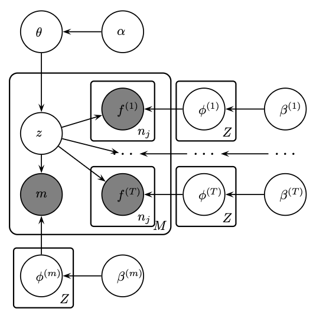

# A Bayesian Mixture Model for Part-of-Speech unsupervised induction using Gibbs sampling.

---

## ✨ What’s inside

Unsupervised Part-of-Speech (POS) induction using a Bayesian Mixture Model trained via Gibbs sampling. The goal is to learn POS categories directly from raw text without labeled tags, applied to the Mapudungun language.

- **Bayesian Mixture Model** for Part-of-Speech induction  
- **Collapsed Gibbs sampling** for efficient inference  
- **Notebooks** for exploration and diagnostics  
- **Resources** with references
- **Packaging** with `pyproject.toml` / `setup.cfg` for editable installs

---

# 🧩 Why This POS Tagger Matters

This Bayesian Mixture Model POS Tagger learns syntactic categories directly from raw text, without requiring any annotated training data.
That’s essential for low-resource languages, where gold-standard POS labels simply don’t exist.

It replaces expensive manual annotation with statistical inference.

## 🌍 What Is a Low-Resource Language?

A low-resource language is one that lacks large annotated datasets, digital corpora, or linguistic tools (such as parsers, taggers, or dictionaries) that are typically available for major world languages like English, Spanish, or Chinese.

In practice, this means:

- There are few or no labeled corpora for supervised learning.
- There are limited digital texts and linguistic resources (grammars, lexicons).

## Data

This tagger is designed to work with the [**Mapudungun Corpus**](https://github.com/lqrz/mapudungun-corpus), a companion dataset repository that provides preprocessed text data in Mapudungun for linguistic modeling and evaluation.

--- 

# Generative Model

## 🔹 Random Variables

| Symbol | Meaning |
|:-------:|:---------|
| θ | Mixing proportions over syntactic classes (class priors) |
| zⱼ | Latent class assigned to word type *j* |
| φᵢ | Multinomial distribution over features for class *i* |
| fⱼₖ | Observed feature for the *k*-th token of word type *j* |
| α, β | Dirichlet hyperparameters controlling sparsity and smoothing |

## 🔹 Generative Story

1. **Latent class priors**  
   Draw a class prior distribution:  θ | α  ∼ Dirichlet(α)

2. **For each syntactic class i = 1...Z:**  
   Draw a multinomial distribution over features:  φᵢ | β ∼ Dirichlet(β)

3. **For each word type j = 1...M:**
   - Choose its latent class:  zⱼ | θ ∼ Multinomial(θ)
   - For each of its nⱼ observe token features:  fⱼₖ | φ_zⱼ ∼ Multinomial(φ_zⱼ)

---

## 📚 Acknowledgements

* [_Christodoulopoulos, et al_](resources/a_bayesian_mixture_model_for_pos_induction_using_multiple_features.pdf): "A Bayesian Mixture Model for Part-of-Speech Induction Using Multiple Features".
